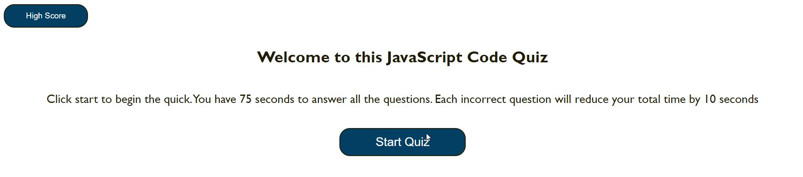
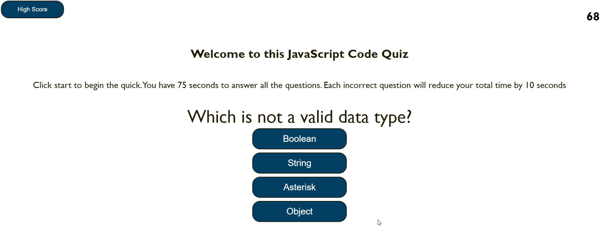
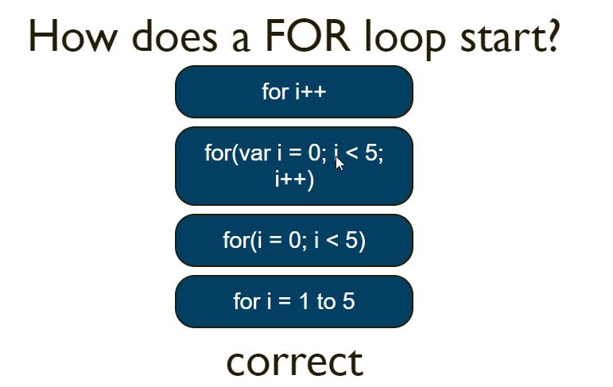
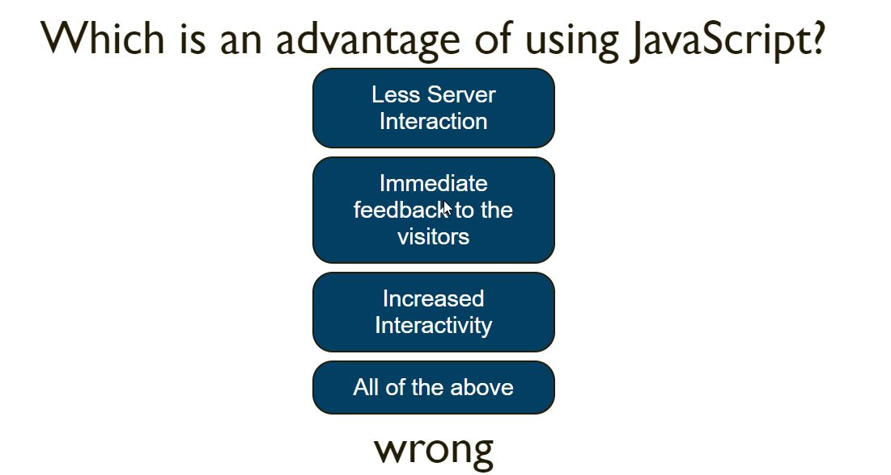
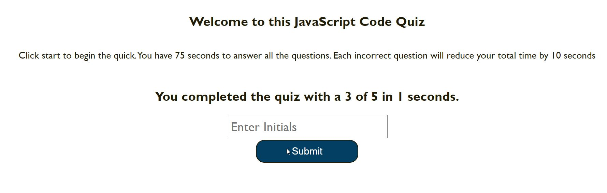
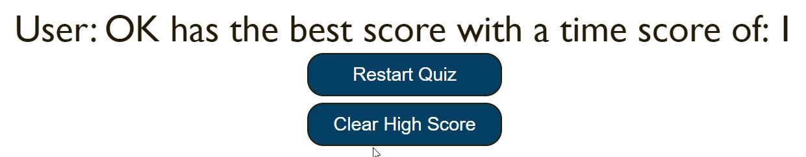
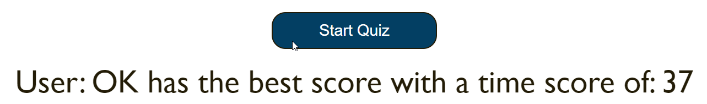
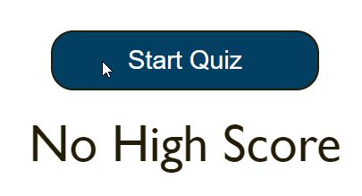

# Challenge 4: Web APIs Challenge: Code Quiz

## About/Description

This is a quiz code quiz currently with five questions.  The user has 75 seconds to answer each question but if they get a wrong answer the user loses ten seconds.
After the game is finished the user is asked to enter their initials.  The game checks local storage for a current high score.  If one exists it checks if the current
finish time is better.  If it is better then it switchs to the next page displaying the high score with buttons to restart the game or clear the high score.  If the current
score is not better an alert is displayed saying the score is not higher and the user is taken forward and it displays the highest score with the same buttons to restart 
or clear the high score. If user clicks the high score button in the top right they see the current highest score. If no high score exists then a message displays that no score currently exists.

### User/Story
AS A coding boot camp student
I WANT to take a timed quiz on JavaScript fundamentals that stores high scores
SO THAT I can gauge my progress compared to my peers

### Acceptance Criteria
GIVEN I am taking a code quiz
WHEN I click the start button
THEN a timer starts and I am presented with a question
WHEN I answer a question
THEN I am presented with another question
WHEN I answer a question incorrectly
THEN time is subtracted from the clock
WHEN all questions are answered or the timer reaches 0
THEN the game is over
WHEN the game is over
THEN I can save my initials and score

## Built With
* HTML
* CSS
* Javascript

## Live Link

https://ds1242.github.io/code-quiz/ 

## Screenshots

#### The page when opened:

#### Display question with answer options and timer

#### Feedback if correct answer is clicked

#### Feedback if wrong answer is clicked

#### Enter initials when the game is done

#### Display the current high score initials and time score and buttons to restart the quiz or clear the high score

#### If user clicks the high score button from the opening page and a high score exists

#### if user clicks the high score button from the opening page and no current high score exists

